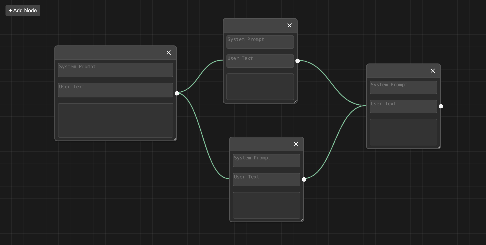

# Lit GPT Flow (Formerly Lit Playground)

WIP Demo here: https://lit-gpt-playground.netlify.app/

This is a webapp that will use Lit Web Components to assemble an "OpenAI Prompt" workflow- an app created to get hands on experience working with Lit Components.

The app's purpose is to allow someone to set up a "Flow" of AI Prompts, taking text inputs, running them along prompts, then feeding them to different sets of inputs.
Think similar to apps like Zapier, Make, etc. but for AI prompts.

## NOTE: As of Wednesday May 7th, this is still a Work in Progress!

I'm building this app over the course of a few days, it's not done yet! What's left to do:

* Fix error flagging for node connections (circular connections, etc.)
* Implement "Play button" that will run the flow with AI prompts
* Update Nodes so the user input is hidden, if it has nodes connected to it
* Add ability to delete/remove connections
* Visual polish!
